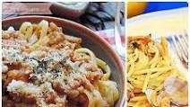

% Habits
% John Doe
% March 22, 2005

# In the morning

## Getting up

- Turn off alarm
- Get out of bed

## Breakfast

:::::::::::::: {.columns}
::: {.column width="50%"}
- Eat eggs
- Drink coffee
:::
::: {.column width="50%"}
- Eat eggs again
- Drink coffee again
:::
::::::::::::::

# In the evening

## Dinner

:::::::::::::: {.columns}
::: {.column width="50%"}
- Eat spaghetti
- Drink wine
:::
::: {.column width="50%"}

:::
::::::::::::::

------------------

Another text

## Going to sleep

- Get in bed
- Count sheep
